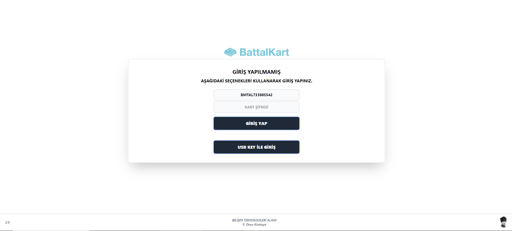
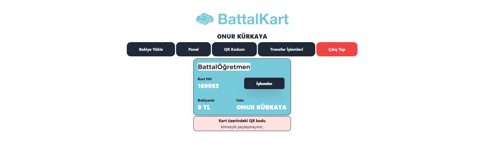
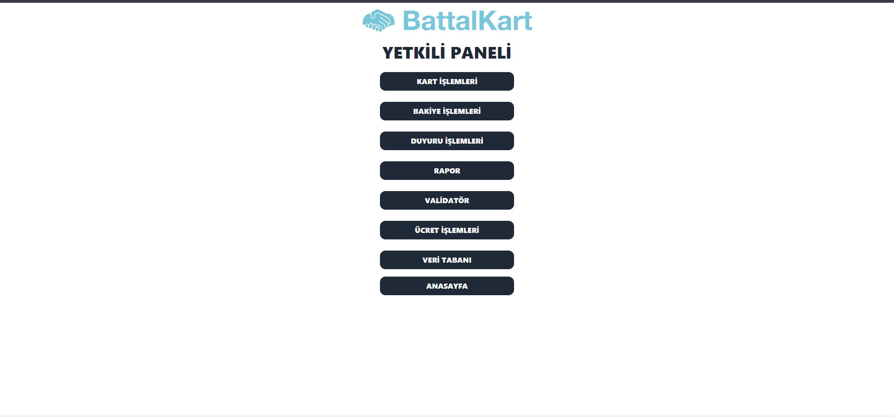
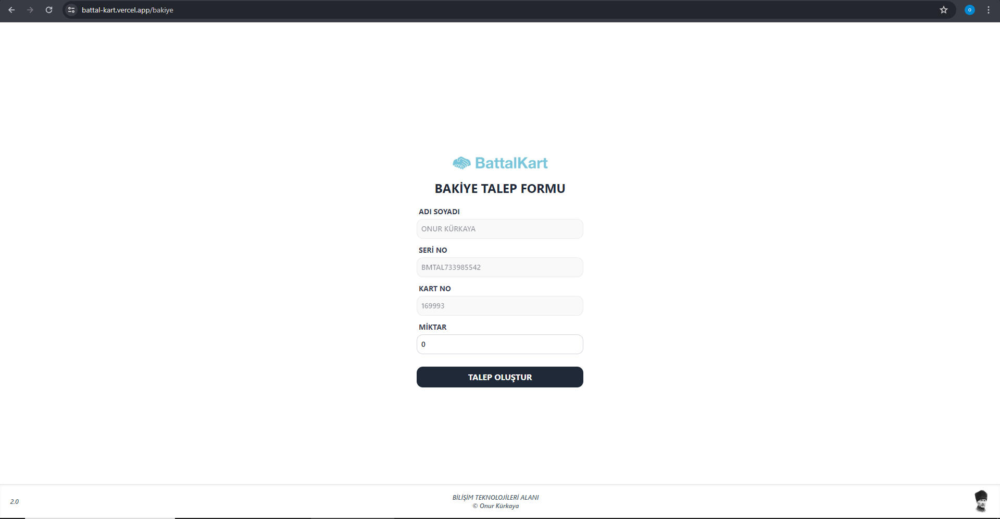
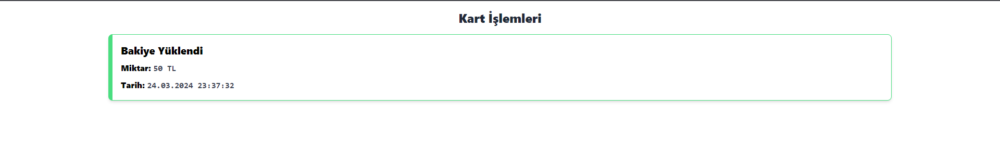

  

<h1>BATTALKART Nedir?</h1>

Okulumdaki yemekhane için geliştirmiş olduğum kartlı geçiş ve ödeme sistemidir. Bu sistem, öğrenci ve öğretmenlerin yemekhane girişinde kendi kartlarını bir validatöre okuttuklarında, kartlarında bulunan bakiyeden yemek ücretinin düşülerek geçişlerini sağlar.

<h2>PROJE RESİMLERİ</h2>

<h4>GİRİŞ SAYFASI</h4>

<h4>ANASAYFA</h4>

<h4>PANEL</h4>

<h4>PANEL KART İŞLEMLERİ</h4>

<h4>BAKİYE</h4>

<h4>PANEL BAKİYE İŞLEMLERİ</h4>

<h4>BAKİYE TALEPLERİ</h4>

<h4>KART HAREKETLERİ</h4>

